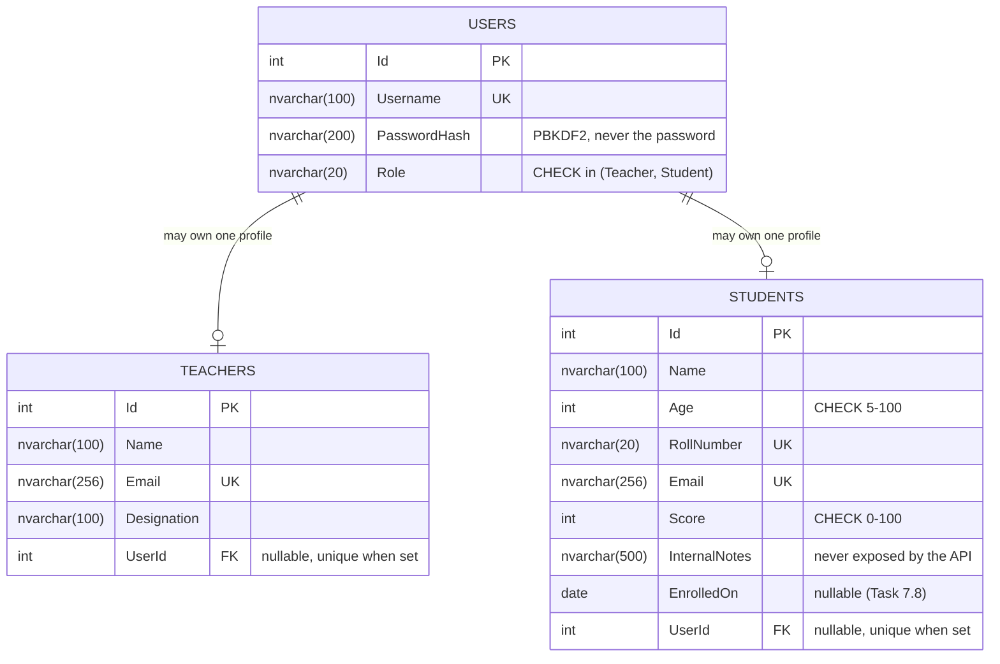

# ER diagram - Users / Teachers / Students (Task 7.1)



Plain-text version:

```
+-----------------+         +--------------------+
| Users           | 1   0..1| Teachers           |
|-----------------|---------|--------------------|
| Id (PK)         |         | Id (PK)            |
| Username (UQ)   |         | Name               |
| PasswordHash    |         | Email (UQ)         |
| Role (CHECK)    |         | Designation        |
+-----------------+         | UserId (FK, UQ*)   |
        | 1                 +--------------------+
        |
        | 0..1   +----------------------+
        +--------| Students             |
                 |----------------------|
                 | Id (PK)              |
                 | Name                 |
                 | Age (CHECK 5-100)    |
                 | RollNumber (UQ)      |
                 | Email (UQ)           |
                 | Score (CHECK 0-100)  |
                 | InternalNotes        |
                 | EnrolledOn (nullable)|
                 | UserId (FK, UQ*)     |
                 +----------------------+
  * filtered unique index: unique only when not NULL
```

## Why this is (at least) 3NF

- **1NF** - every column holds one atomic value. There are no repeating
  groups (no "Subject1, Subject2" columns) and every table has a primary key.
- **2NF** - every key is a single surrogate `Id`, so no column can depend on
  only part of a key.
- **3NF** - no non-key column depends on another non-key column. Login data
  (`Username`, `PasswordHash`, `Role`) lives only on `Users`, so a student's
  role isn't repeated on `Students`, and a username change touches one row.
  Profile data lives only on `Students`/`Teachers`. The link is a foreign key
  (`UserId`), not a copy of user columns.

Splitting credentials from profiles also has a security payoff. `Users` is
small, schema-stable and can be permissioned separately (the API's login
path only ever needs `SELECT` on it), which is why Week 10 gives it its own
Identity service and database.
